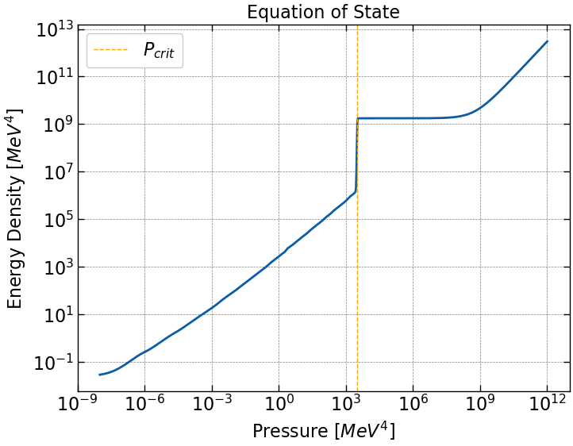
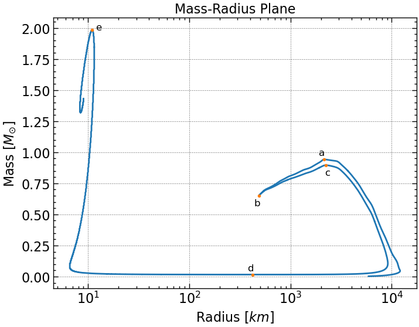
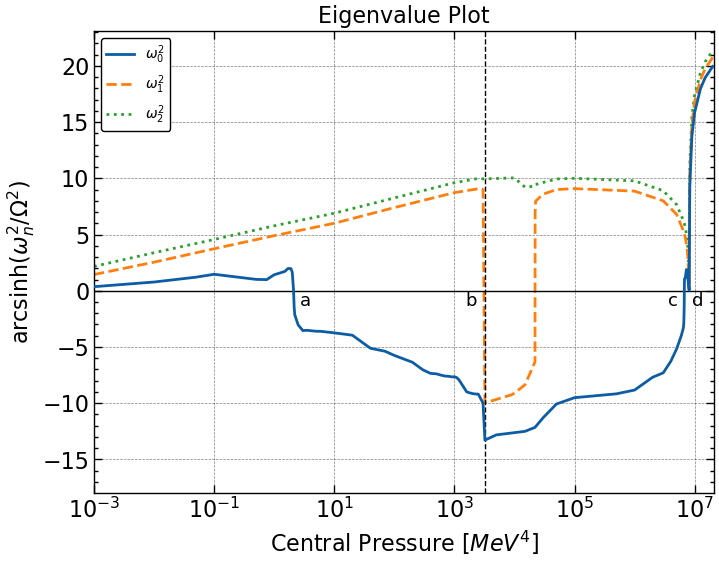
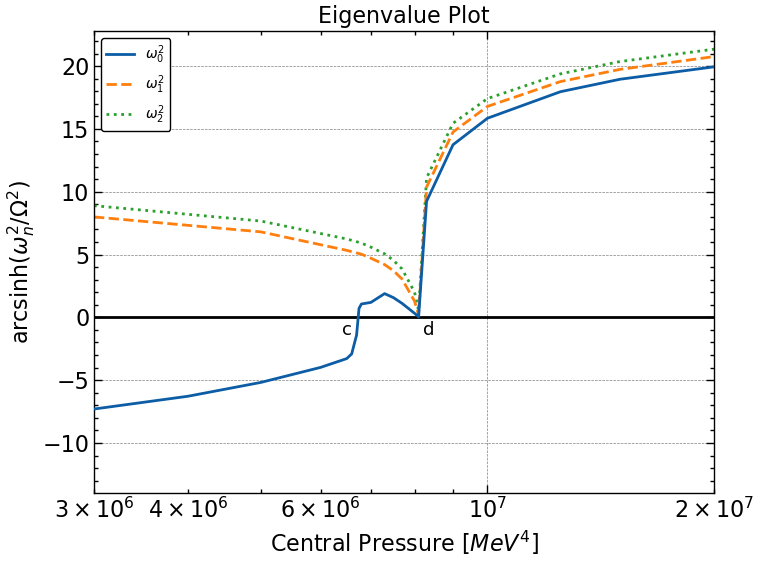

# Stability Of Strange Dwarfs

This is the code I wrote for my bachelor thesis in the Physics Department of Aristotle University of Thessaloniki, "Stability of Strange Dwarfs" | Supervisor: Ch. C. Moustakidis. This project was the first time I used Python and learnt Computational Physics, so the code is efficientwise speaking, not the most optimal, .  
The whole thesis can be accessed for free using AUTh's website, [here](https://ikee.lib.auth.gr/record/360475/?ln=en). 

The whole goal of the thesis was to calculate the fundamental eigenvalue of the Sturm-Liouville Stability Problem of Strange Dwarf star configurations, in order to determine their stability. The whole thesis was based on two papers:  
* ["On the Stability of Strange Dwarf Hybrid Stars", Alford (2017)](https://arxiv.org/abs/1705.09880)
* ["Possible New Class of Dense White Dwarfs", Glendenning (1995)](https://ui.adsabs.harvard.edu/abs/1995PhRvL..74.3519G/abstract)

The files of this repository are:  
:one: "main.ipynd": The main code. Used for calculating the fundamental eigenvalue of a star configuration given its central pressure.  
:two: "MRPlane.ipynd": The code used to create the MR Plane.  
:three: "Eigenvalues.ipynd": The code used to plot the results of all the eigenvalues.  
:four: "BPS.dat": The file that contains the data of Baym-Pethick-Sutherland's equation of state.  
:five: The resulting graphs of the thesis.  

Lastly, I present the basic results of our analysis.
The Equation of State of Strange Dwarf stars is modelled as following:  

The MR Plane came out as:  

The resulting fundamental eigenvalues of all configurations with respect to their central pressure are presented here:

 
